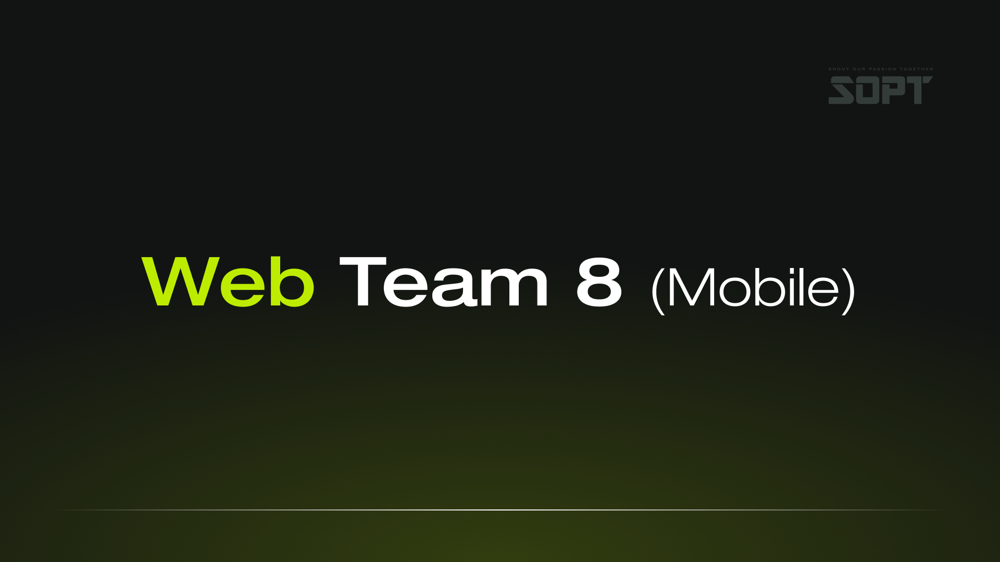

<div align="center">



# Spotify-FE

> 『NOW SOPT 34기 Web Team 8』 합동세미나 진행을 위한 저장소입니다.

</div>


<div align="center">

</div>


## 🌱 WEB Developer

| <center> 장정안 </center>                                                                          | <center>김채현 </center>                                                                                | <center>김지원</center>                                                                           |
| -------------------------------------------------------------------------------------------------- | ------------------------------------------------------------------------------------------------------- | ------------------------------------------------------------------------------------------------- |
| <center> </center> | <center></center> | <center></center> |
| <center>메인 페이지</center>                                                                | <center>카테고리 페이지, 낙관적 업데이트, 필터링</center>                                                                     | <center>플레이리스트 페이지, 마이페이지, 무한 스크롤</center>                                                               |
| [@exceptanyone](https://github.com/ExceptAnyone)                                                               | [@imddoy](https://github.com/imddoy)                                                                  | [@Kjiw0n](https://github.com/Kjiw0n)                                                          |


<h2> 🛠 기술스택 </h2>

`TypeScript`

`React`

`yarn create vite` 

`styled-components`   

`Tanstack-query`

`Axios`


<br/>

<h2>  📄 컨벤션 및 브랜치 전략 </h2>
깃 컨벤션 https://www.notion.so/12e8cb2a6f17436ab528b86daa299dbe?pvs=4 <br />
커밋 컨벤션 https://www.notion.so/3eb93c6b3ee640ee9d0be0960e3dd456?pvs=4
코딩 컨벤션 

- 머지
    - 머지는 squash로!!

- 타입스크립트 관련
    - interface Props 네이밍 = 해당 컴포넌트명 + Props
    - 서버측에서 받는 response 타입은 remote.ts
    - 클라측 타입은 client.ts

- 스타일 코드
    - 가장 바깥 영역은 컴포넌트명+Wrapper
    - 그 안 영역은 역할+container
    - 스타일 코드는 분리하지 않고 합쳐서!

- 네이밍 (컴포넌트 & 폴더)
    - 컴포넌트 명 ⇒ PascalCase (대문자 시작)
    - 폴더 명 ⇒ camelCase (소문자 시작)

- 리액트 쿼리
    - hooks/queries에 분리
 
- 단위는 모두 rem으로!
    - 단, border 관련 속성은 px

<br/>

<h2> 📁 폴더 구조 </h2>
https://www.notion.so/95693af9ec5c4681b5aa9edf0dc08562?pvs=4
```
```

